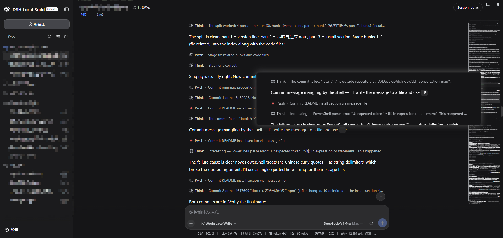
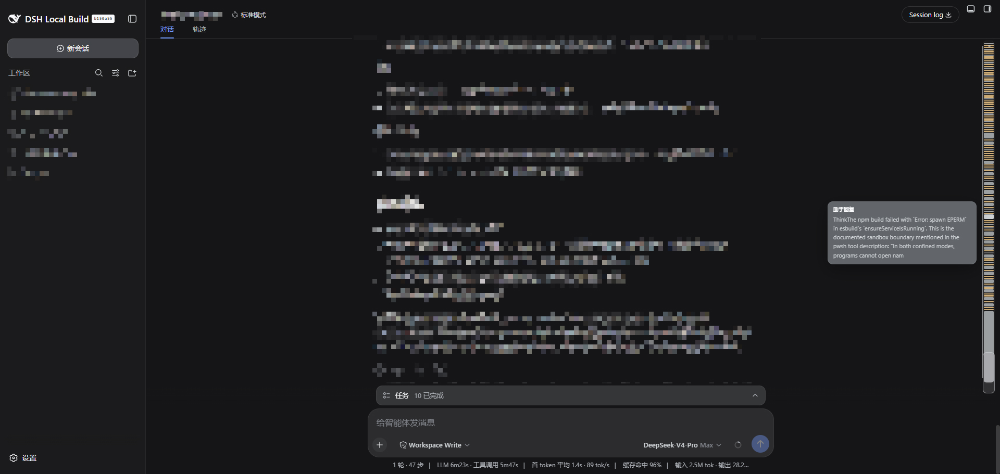

# 🗺️ dsh-conversation-map

[English](README.en.md) · 中文

> 会话代码地图（Conversation Minimap）—— DeepSeek Harness (`dsh`) Web 客户端插件。

<p align="center">
  <a href="https://www.npmjs.com/package/dsh-conversation-map"></a>
  <a href="https://www.npmjs.com/package/dsh-conversation-map"></a>
  <a href="https://github.com/afoxsss/dsh-conversation-map/blob/main/LICENSE"></a>
  <a href="https://github.com/afoxsss/dsh-conversation-map"></a>
  <a href="https://github.com/deepseek-ai/deepseek-harness"></a>
</p>

当前版本：**0.1.6**

在对话区右侧渲染一条可拖动的**会话代码地图**，像编辑器的 minimap 一样预览整段会话并快速滚动：

## ✨ 功能特性

- 🎨 **双模式**：宽度 < 50px 为**色块模式**（按消息类型着色：🔵 用户 / ⚪ 助手 / 🟡 工具调用 / 🟢 命令 / 🔴 错误，悬停弹出内容预览）；宽度 ≥ 50px 自动切换为**缩略图模式**（整段会话按比例缩微显示，能看到消息、代码块、卡片的真实结构）。
- ↔️ **拖动调宽**：按住地图左侧把手左右拖动（10–320px），右缘固定，拖动时显示实时宽度徽标。
- ⚡ **快速滚动**：点击任意位置跳转，按住拖动连续滚动；半透明视口指示条实时显示当前可见区域。
- 🔍 **悬停放大预览**：缩略图模式下悬停地图任意位置，光标左侧实时弹出放大预览窗口，**整行完整展示**，跟随鼠标移动实时刷新。
- 📌 **收起/展开**：悬停地图顶部点击 `»` 收起为 4px 细条；收起后细条顶部常显 `«` 标签，点击标签或细条展开。
- 🔄 **实时同步**：消息流式输出、工具调用、切换会话时自动刷新；开合侧栏/详情面板、窗口缩放自动跟随。
- 📐 **高度自适应**：地图高度随会话内容实时伸缩——缩略图在任何内容量下都保持真实宽高比、不纵向拉伸；高度随内容连续增长至封顶可用高度，内容超过轨道后缩微图随滚动垂直平移（minimap 语义），可见区始终落在轨道内。

## 📸 截图

**缩略图模式**（加宽后，整段会话按比例缩微显示）：



**色块模式**（窄条，按消息类型着色，悬停预览）：



## 🚀 安装

安装最新版（默认）：

```sh
dsh plugin --profile web add dsh-conversation-map
```

安装指定版本（`dsh plugin add` 直接透传 pnpm 参数，支持任意 npm 版本写法）：

```sh
# 固定某个版本
dsh plugin --profile web add dsh-conversation-map@0.1.6

# 升级到最新版
dsh plugin --profile web update dsh-conversation-map@latest
```

验证层已挂载，然后启动：

```sh
dsh --profile web --dump-config   # 应出现 "# == dsh-conversation-map" 层
dsh --profile web
```

🗑️ 卸载：`dsh plugin --profile web remove dsh-conversation-map`

## 🧩 兼容性说明

- 🧭 **DOM 契约**：DeepSeek Harness 处于 **developer preview**，接口会破坏性变更；本插件当前基于 `dsh` 0.1.x 的 Web 会话 DOM 契约实现：
  - `[data-conversation-scroll]` 会话滚动容器（注意：切换会话时框架会重建会话列，该容器每次都是新节点，插件通过稳定祖先观察 + 每次计算重解析自动跟随）
  - `[data-chat-anchor-key]` / `[data-chat-flow-kind]` 会话节点行
  - `[data-composer-seat]` 底部输入区
- 🧲 **地图常驻**：切换会话无需刷新，色块/缩略图内容自动同步当前会话；新会话加载期间显示空轨道。
- 💾 **状态持久化**：宽度与收起状态持久化于浏览器 `localStorage`（键 `dsh-conversation-map:width` / `dsh-conversation-map:collapsed`），切换会话与刷新页面均保持。
- 🔒 **纯客户端**：Host 半身是空实现，浏览器半身通过 `shell.overlay` 槽位挂载，仅使用平台模块 `react` 与 `slots` 服务，无网络请求、无遥测（除上述 localStorage 本地状态外无其他持久化）。

## 🛠️ 开发

```sh
pnpm install
pnpm run build    # tsdown → lib/client.js（__ModuleLoader__ 工厂包壳）
```

构建产物契约：CJS + `window.__ModuleLoader__.load({ id, factory })` 包装；`react` 等平台模块保持外部引用，其余依赖全部内联（本插件除 `react` 外无其他依赖）。

## ⚙️ 自定义

- 缩略图阈值：`src/client/index.ts` 中的 `THUMB_MIN_WIDTH`（默认 50）
- 宽度范围：`WIDTH_MIN` / `WIDTH_MAX`（默认 10 / 320）
- 缩略图刷新节流：`THUMB_CLONE_INTERVAL`（默认 200ms）
- 放大镜参数：`LOUPE_W` / `LOUPE_H`（默认 854 / 200，整行按面板宽度等比展示）、`LOUPE_SCALE`（放大上限，默认 1 = 真实比例）

## 📄 License

MIT

---

<p align="center">🧰 推荐插件仓库：<a href="https://github.com/dsh-market/dsh-market">dsh-market</a></p>

<p align="center">Made with ❤️ for DeepSeek Harness · <a href="https://github.com/afoxsss/dsh-conversation-map">GitHub</a> · <a href="https://www.npmjs.com/package/dsh-conversation-map">npm</a></p>
